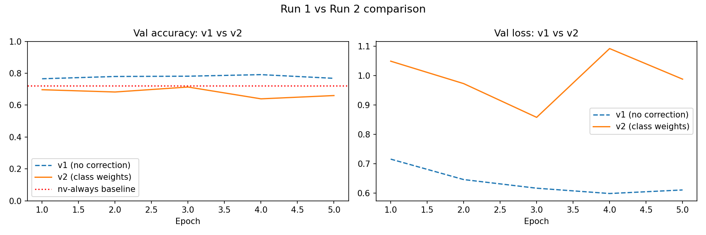
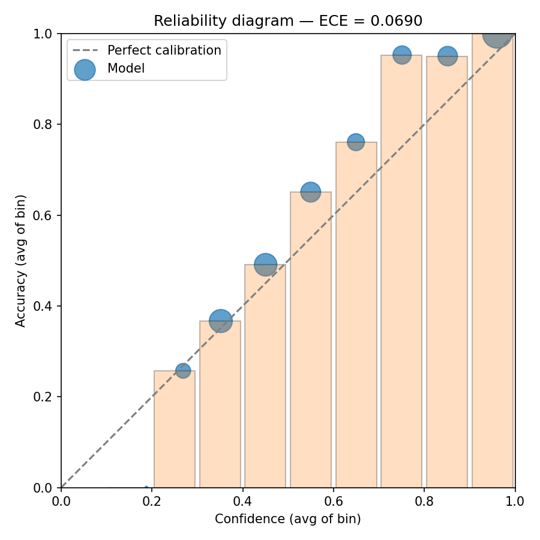
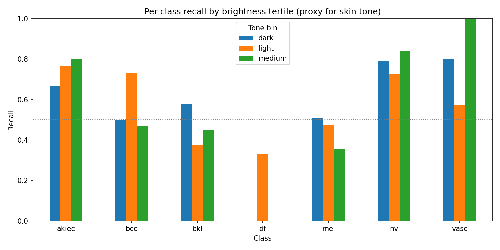

# Kramer Classifier — Phase 2 Capstone

A neonatal jaundice severity classifier based on the Kramer dermal staging system.

**Status:** Learning prototype — in progress. Demo target 2026-05-22.

---

## Honest framing (read this first)

This is a learning project, not a deployable model. Public neonatal jaundice imagery is sparse, so I'm training on the HAM10000 skin lesion dataset as a stand-in. The model architecture (pretrained ResNet50 with a fine-tuned classifier head), the training loop, and the evaluation pipeline are the same techniques the production neonatal jaundice classifier uses. The main difference is the training data — adult dermoscopy images instead of neonatal jaundice photos.

**What this project demonstrates:** end-to-end image classification, transfer learning, handling severe class imbalance, evaluation beyond raw accuracy.

**What this project does NOT demonstrate:** validation on real neonatal jaundice, clinical readiness, or skin-tone fairness on the actual target population.

## Background — Kramer scale

The Kramer scale (Kramer 1969) describes the cephalocaudal progression of jaundice in newborns through five visual zones:

- **Zone 1:** Face and neck
- **Zone 2:** Upper trunk
- **Zone 3:** Lower trunk and thighs
- **Zone 4:** Arms and lower legs
- **Zone 5:** Palms and soles

Higher zones correspond to higher serum bilirubin levels and greater clinical urgency. Visual Kramer assessment is widely used as a screening tool in resource-limited settings where transcutaneous bilirubinometers are unavailable.

## Dataset — HAM10000

Harvard Dataverse, ~10k dermoscopy images across 7 lesion classes. After a stratified 70/15/15 split: 5229 train / 1120 val / 1121 test. Severely imbalanced — `nv` (melanocytic nevi) is ~72% of training data, `df` (dermatofibroma) is <2%. That imbalance is useful here: it mirrors the dynamic the production model will face, where most neonatal images will be healthy/low-zone and high-severity zones are rare.

Data setup instructions in [NOTES.md](NOTES.md). `data/` is gitignored — images are never committed.

## Approach

1. Stratified 70/15/15 split using [src/prepare_data.py](src/prepare_data.py).
2. EDA — class distribution, image dimensions, sample images per class. See [notebooks/01-eda.ipynb](notebooks/01-eda.ipynb).
3. Train ResNet50 with the backbone frozen, two runs back-to-back. See [notebooks/02-baseline-resnet.ipynb](notebooks/02-baseline-resnet.ipynb):
   - **Run 1** — no imbalance correction. Watch it fail on minority classes.
   - **Run 2** — class-weighted cross-entropy. Same architecture, same data, same LR. Compare.
4. Held-out test-set evaluation on the winning run. *(done — see notebook 03 Part A)*
5. Calibration analysis — reliability diagram, ECE. *(done — see notebook 03 Part B)*
6. Skin-tone fairness audit using a brightness proxy. See [notebooks/03-skin-tone-fairness.ipynb](notebooks/03-skin-tone-fairness.ipynb). *(done — Part C)*
7. **Run 3** — lighting-robust augmentation. Same class weighting as Run 2; only the training augmentation changes. Benchmarked against Run 2 using the same brightness-tertile proxy. See [notebooks/04-lighting-robustness.ipynb](notebooks/04-lighting-robustness.ipynb).

## Results

### Validation set — Run 1 vs Run 2 (the class-weighting comparison)

| Metric | Run 1 — no weighting | Run 2 — class-weighted |
|---|---|---|
| Val accuracy | 0.7964 | 0.7027 |
| Macro-avg F1 | 0.44 | 0.47 |
| `df` recall | 0.18 | 0.55 |
| `vasc` recall | 0.07 | 0.67 |
| `mel` recall | 0.24 | 0.40 |
| `nv` recall | 0.96 | 0.78 |

Run 1 looks better on raw accuracy, but it's mostly predicting `nv` for everything — the dominant class makes that strategy "work." Run 2's accuracy drops because the model stops cheating, and minority-class recall jumps 2-9× in exchange. That tradeoff is the whole point of the comparison.



### Held-out test — Run 2 (the winning model)

Test accuracy **0.7244**, macro-F1 **0.474**. Slightly *higher* than val (0.7027), so no overfitting.

| class | test recall | precision | support |
|---|---|---|---|
| `nv` | 0.789 | 0.973 | 811 |
| `mel` | 0.587 | 0.289 | 92 |
| `bcc` | 0.592 | 0.475 | 49 |
| `bkl` | 0.550 | 0.488 | 109 |
| `akiec` | 0.543 | 0.463 | 35 |
| `vasc` | 0.571 | 0.320 | 14 |
| `df` | 0.182 | 0.077 | 11 |

`df` is the worst class on both axes (when the model says `df` it's wrong 92% of the time, and it only catches 18% of true `df`). But test support for `df` and `vasc` is in the low double digits, so per-class numbers swing several percentage points per misclassification — quote them with support attached.

### Calibration

ECE (10 bins) **= 0.0833**. Mean confidence 0.6418, mean accuracy 0.7244 — the model is **underconfident** on average (gap ≈ -8pp). The class weighting that fixed minority-class recall also spread probability mass across classes, lowering the max-softmax confidence per prediction without changing the argmax.



The production validation gate for this kind of model is ECE ≤ 0.04, so this prototype is roughly 2× over that bar. Temperature scaling on a held-out calibration split would be the standard fix.

### Lighting robustness — Run 2 vs Run 3

Run 3 trains with aggressive lighting augmentation on top of Run 2's class weighting:

| Augmentation | Run 2 | Run 3 |
|---|---|---|
| ColorJitter brightness | 0.2 | 0.5 |
| ColorJitter contrast | 0.2 | 0.5 |
| ColorJitter saturation | 0.2 | 0.4 |
| ColorJitter hue | — | 0.1 |
| RandomAutocontrast | — | p=0.3 |
| RandomEqualize | — | p=0.2 |
| GaussianBlur | — | σ=0.1–1.5 |

`brightness=0.5` means the model sees images at 50–150% of original exposure during training — covers underexposed bedside photos and overexposed fluorescent-lit nurseries.

Benchmarked by brightness tertile (same proxy as the fairness audit below). A smaller gap across dark/medium/light bins = better robustness to real-world lighting variation. See [notebooks/04-lighting-robustness.ipynb](notebooks/04-lighting-robustness.ipynb) and `results/lighting_robustness_comparison.png` for the full comparison.

**Production roadmap** beyond this prototype: (1) CLAHE illumination normalization at inference — no retraining needed; (2) test-time augmentation over lighting variants; (3) real validation with neonatal images under controlled lighting variation.

---

### Skin-tone fairness (brightness proxy — see caveats)

| brightness bin | accuracy | mean confidence | n |
|---|---|---|---|
| dark | 0.751 | 0.624 | 374 |
| medium | 0.735 | 0.668 | 373 |
| light | 0.687 | 0.633 | 374 |

6.4pp gap between best (dark) and worst (light) bins. Counterintuitive on the surface, but in HAM10000 brightness mostly tracks **lesion color** (high-contrast lesions against pale skin tend to fall in the "light" bin), not patient skin tone. So this is the technique demo, not a finding: the analysis pipeline works, the proxy is too weak to draw conclusions about real skin-tone bias. A real audit needs Fitzpatrick-labeled neonatal data.



## Limitations

- HAM10000 is **adult dermoscopy imagery**, not **neonatal jaundice**. Visual cues overlap (skin tone, pigmentation, color gradients), but the clinical task is different. A model trained here cannot be used clinically.
- HAM10000 ships no Fitzpatrick skin tone labels, so the fairness notebook uses a brightness proxy that mostly tracks lesion color rather than patient skin tone. The pipeline is the right pipeline; the proxy is weak.
- ECE is roughly 2× the production gate. The prototype demonstrates *measuring* calibration; recalibration (temperature scaling) is a natural next step.
- Per-class support on `df` (11) and `vasc` (14) is too small to read those numbers with much confidence.
- The lighting robustness benchmark (Run 3) uses the same brightness-proxy tertiles as the fairness audit. In HAM10000 this mostly tracks lesion color rather than ambient light. The technique is right; measuring it on neonatal data captured under varied lighting is the real validation.

## Structure

```
kramer-classifier/
├── README.md                       (this file)
├── NOTES.md                        (data download + setup)
├── requirements.txt
├── data/                           (gitignored)
│   ├── train/  val/  test/
├── notebooks/
│   ├── 00-demo.ipynb               10-minute boss demo walkthrough (start here)
│   ├── 01-eda.ipynb                done
│   ├── 02-baseline-resnet.ipynb    done (Run 1 + Run 2)
│   ├── 03-skin-tone-fairness.ipynb done (test eval + calibration + fairness)
│   ├── 04-lighting-robustness.ipynb Run 3 training + brightness-bin comparison
│   └── 05-temperature-scaling.ipynb post-hoc calibration, learns scalar T on val set
├── src/
│   ├── prepare_data.py             stratified split
│   ├── data.py                     dataloaders + augmentation
│   ├── model.py                    ResNet50 with frozen backbone
│   ├── train.py                    training loop
│   └── evaluate.py                 metrics, confusion matrix
└── results/
    ├── v1_training_curves.png
    ├── v1_confusion_matrix.png
    ├── v2_confusion_matrix.png
    ├── v3/best_model.pt             (Run 3 checkpoint, after running notebook 04)
    ├── comparison.png
    └── lighting_robustness_comparison.png  (Run 2 vs Run 3 brightness-bin chart)
```

## What's next

- [x] Held-out test-set evaluation on Run 2 (the winning model)
- [x] Reliability diagram + ECE for calibration
- [x] Skin-tone fairness notebook — brightness-binned per-class recall
- [x] Lighting robustness — Run 3 with aggressive augmentation, brightness-bin comparison
- [x] Final README pass with test-set numbers
- [x] 10-minute demo notebook — [notebooks/00-demo.ipynb](notebooks/00-demo.ipynb)
- [x] Temperature-scaling recalibration — [notebooks/05-temperature-scaling.ipynb](notebooks/05-temperature-scaling.ipynb)

## Reproducing

```bash
python3 -m venv .venv && source .venv/bin/activate
pip install -r requirements.txt           # this requirements.txt is pinned
# follow NOTES.md to download HAM10000 and run src/prepare_data.py
jupyter lab notebooks/
```

Run notebooks in order: 01 → 02 → 03.

## Success criteria

- Reproducible from a clean clone via NOTES.md
- Test-set accuracy > 70% on the class-weighted model
- Limitations clearly stated (dataset, fairness, calibration)
- Fairness analysis present, with honest framing about what HAM10000 can and can't tell us about skin-tone bias
